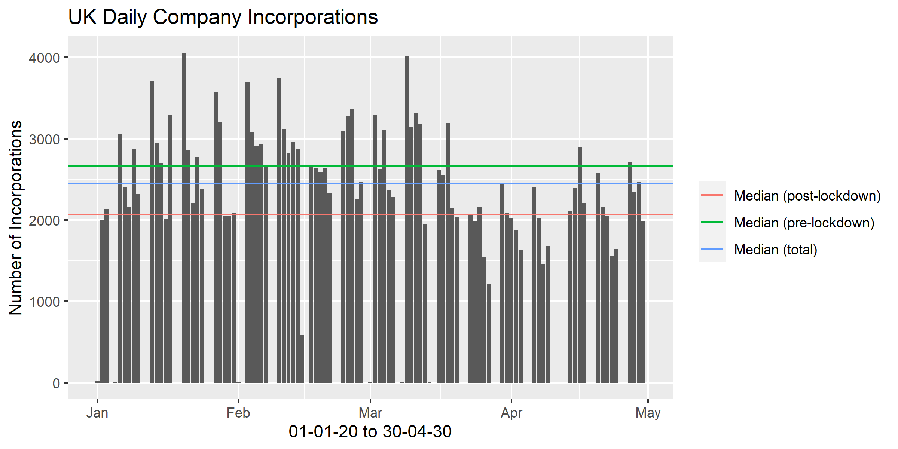

We analyse Companies House ["basic company data"](http://download.companieshouse.gov.uk/en_output.html) up to 30th April.

# Key Points
 * Near real-time indicator of economic activity in the UK.
 * Daily business creation decreases 22% since lockdown.
 * 16,065 fewer businesses were created during lockdown.
 * Business creation is important for productivity and employment.
 
# Analysis
The below chart shows daily company incorporations in the UK for 2020.

This can be compared to daily covid-19 policy interventions: 
 
1. Mon 16 March: Non-essential travel prohibited.
2. Fri 20 March: Pubs etc. closed.
3. Mon 23 March: Lockdown.

The number of new incorporations decline sharply after the third week of March (week ending Fri 20th March), which is when lockdown measures were implemented strictly. 

The daily median goes from 2,664 incorporations per day before lockdown is implemented to 2,070 incorporations per day after lockdown is implemented. This is a fall in business creation of 22%. Therefore, 16,065 less businesses were created, from the beginning of lockdown to the end of April, than would have been created if the pre-lockdown median had persisted. 

This is much less than comparable figures for the US. John Haltiwanger (US Census Bureau) shows a 42% decline in new business applications in the US for the week ending March 28 relative to the same week in 2019 (available [here](http://econweb.umd.edu/~haltiwan/first_look.pdf)). They use [BFS data](https://www.census.gov/data/experimental-data-products/weekly-business-formation-statistics.html), which allows them to focus on _business applications with planned wages_. This is an important distinction because it identifies "genuine" firms as opposed to entities created for accountancy purposes. Our data does not provide this distinction. We focus on all business incorporations regardless of their intended purpose.

## Importance of business creation

Business creation is informative as a measure of economic activity. The main advantage of our data is that it provides a near real-time economic indicator for the UK economy. Unsurprisingly, our analysis confirms a severe and persistent decline in economic activity.

However, business creation is important for deeper economic reasons:

1. Productivity: New firms grow to compete with existing firms. This puts pressure on established firms to continue to innovate and keeps prices low as consumers have alternative choices. Additionally, successful new firms grow faster than existing firms and have higher levels of productivity ([Foster, Haltiwanger and Krizan 2001](https://www.nber.org/chapters/c10129)). In fact, evidence for the US suggests a small number of high-growth startups account for large portions of aggregate productivity, output and employment growth ([Haltiwanger, Jarmin, Kulick and Miranda 2017](https://www.nber.org/chapters/c13492)).

2. Employment: A fall in business creation directly reduces the number of jobs created. This has an ongoing effect as the crisis generation of firms ages ([Sedláček 2019](https://www.sciencedirect.com/science/article/abs/pii/S0304393219300078)). Furthermore, surviving new firms create more jobs than they destroy, so they are net job creators. 

See [Sedláček and Sterk 2020](https://voxeu.org/article/startup-employment-calculator-covid-19) for deeper analysis of these points with reference to the US.

Entering the crisis, the UK had record high levels of employment, but suffered from weak productivity growth. The fall in business creation will decrease UK employment levels and productivity growth will take a further hit. The productivity point should be a major concern for UK policymakers who were already grappling with the UK's "productivity puzzle".

# Data
The full data file in `.csv` format can be found on the Companies House website (available [here](http://download.companieshouse.gov.uk/en_output.html)). The full list of variables is available [here](https://github.com/asavagar/companies_house_data_analysis/blob/master/freeDataProductDataset.pdf). 

The data reports the full companies register for the UK which captures basic company data of live companies on the register. 

The register is informative about number of new incorporations for the recent past. It is less informative further back because when companies are periodically removed from the register their incorporation date is lost, hence we underestimate the number of daily incorporations the further back we go. 

Some historical data is available from the Companies House website through their existing statistical reports:

 * Quarterly publication on [Incorporated Companies in the UK](https://www.gov.uk/search/research-and-statistics?content_store_document_type=published_statistics&keywords=Incorporated&organisations%5B%5D=companies-house&public_timestamp%5Bfrom%5D=&public_timestamp%5Bto%5D=).
    
 * Latest statistical release on [Incorporated Companies in the UK October to December 2019](https://www.gov.uk/government/statistics/incorporated-companies-in-the-uk-october-to-december-2019).

# Code
* The basic company data file (_i.e._ the company register) is ~2GB.
* `00-read.R` reads in necessary variables and saves as a smaller `.csv`.
* `02_tidyanalyze.R` produces the output `new_incorp_barplot.pdf` and `new_incorp_barplot.png`.

# Contributors
This report was developed by members of the [Macroeconomics Research Centre (MaGHiC)](https://research.kent.ac.uk/maghic/), Economics Department, University of Kent.
* Alfred Duncan, İlhan Güner, Miguel León-Ledesma, Anthony Savagar.
